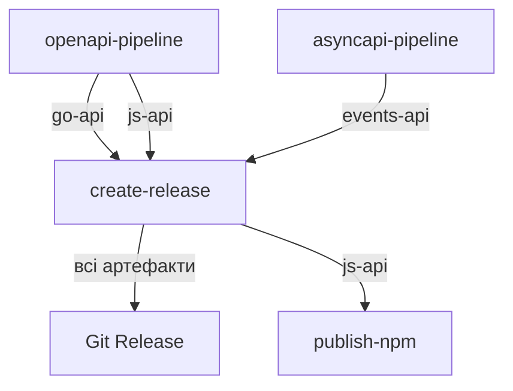

# API Release Workflows - Architecture

## 📁 Структура файлів

```
.github/workflows/
├── api-release.yml           # 🎯 Головний оркестратор
├── openapi-pipeline.yml      # 🔄 OpenAPI pipeline (reusable)
├── asyncapi-pipeline.yml     # 🔄 AsyncAPI pipeline (reusable)
│
├── build-go-api.yml          # 🔧 Build Go API (reusable)
├── build-js-api.yml          # 🔧 Build JS API (reusable)
├── build-asyncapi.yml        # 🔧 Build Events API (reusable)
├── publish-schemas.yml       # 🔧 Publish Avro schemas (reusable)
├── release-tag.yml           # 🔧 Create Git release (reusable)
└── publish-js.yml            # 🔧 Publish to NPM (reusable)
```

## 🏗️ Архітектура

### Рівень 1: Головний оркестратор
**`api-release.yml`** - Єдина точка входу для релізу API

```yaml
prepare → openapi-pipeline → asyncapi-pipeline → create-release → publish-npm
```

### Рівень 2: Pipeline workflows (модульні)

#### **`openapi-pipeline.yml`**
Відповідальність: OpenAPI build
- Генерує Go API (types, client, server)
- Генерує JS/TypeScript client
- Завантажує артефакти: `go-api`, `js-api`

#### **`asyncapi-pipeline.yml`**
Відповідальність: AsyncAPI build
- Перевіряє наявність AsyncAPI файлу
- Генерує Go code з Avro schemas
- Публікує schemas в Schema Registry
- Завантажує артефакт: `events-api`

### Рівень 3: Atomic workflows (переіспользувані)
- `build-go-api.yml` - генерація Go API з OpenAPI
- `build-js-api.yml` - генерація TypeScript client з OpenAPI
- `build-asyncapi.yml` - генерація Events API з Avro/AsyncAPI
- `publish-schemas.yml` - публікація Avro schemas
- `release-tag.yml` - створення Git тега і релізу
- `publish-js.yml` - публікація в NPM registry

## 🎯 Переваги нової структури

### ✅ Розділення відповідальностей (Separation of Concerns)
- **OpenAPI** → `openapi-pipeline.yml`
- **AsyncAPI** → `asyncapi-pipeline.yml`
- **Release** → один спільний job з усіма артефактами

### ✅ Модульність
Кожен pipeline можна:
- Запустити окремо для тестування
- Переіспользовувати в інших проектах
- Легко розширювати

### ✅ Умовне виконання
```yaml
asyncapi-pipeline:
  if: needs.prepare.outputs.has_asyncapi == 'true'
```
AsyncAPI pipeline виконується тільки якщо файл існує

### ✅ Один реліз з усіма артефактами
```yaml
create-release:
  artifacts: 'go-api,events-api,js-api'
  artifact_dirs: 'api,events,js-client'
```
Всі артефакти додаються в один Git release

### ✅ Легко зрозуміти потік
```
api-release.yml
  ├─ prepare (визначає версії)
  ├─ openapi-pipeline
  │   ├─ build-go-api
  │   └─ build-js-api
  ├─ asyncapi-pipeline (якщо є файл)
  │   ├─ build-events-api
  │   └─ publish-schemas
  ├─ create-release (збирає всі артефакти)
  └─ publish-npm
```

## 🚀 Використання

### Для проекту з OpenAPI + AsyncAPI

```yaml
# В репозиторії проекту: .github/workflows/release.yml
name: Release

on:
  push:
    branches: [main]

jobs:
  release:
    uses: Sokol111/ecommerce-infrastructure/.github/workflows/api-release.yml@master
    secrets:
      NPM_TOKEN: ${{ secrets.NPM_TOKEN }}
      SCHEMA_REGISTRY_URL: ${{ secrets.SCHEMA_REGISTRY_URL }}
```

### Для проекту тільки з OpenAPI

```yaml
jobs:
  release:
    uses: Sokol111/ecommerce-infrastructure/.github/workflows/api-release.yml@master
    secrets:
      NPM_TOKEN: ${{ secrets.NPM_TOKEN }}
    # AsyncAPI pipeline автоматично пропуститься
```

### Параметризація

```yaml
jobs:
  release:
    uses: Sokol111/ecommerce-infrastructure/.github/workflows/api-release.yml@master
    with:
      openapi_file: api/openapi.yaml  # custom path
      version: v1.2.3                 # custom version
      npm_repo_name: "@myorg/my-api"
      project_name: my-awesome-api
    secrets:
      NPM_TOKEN: ${{ secrets.NPM_TOKEN }}
```

## 🔄 Потік даних (артефакти)



### Артефакти в релізі:
- **`api/`** - Go API (models, client, server)
- **`events/`** - Events API (Avro-generated Go types)
- **`js-client/`** - TypeScript client для NPM

## 📋 Чеклист міграції

Якщо ви використовували старий `build-and-release-go-js-api.yml`:

1. ✅ Створені нові workflows:
   - `api-release.yml`
   - `openapi-pipeline.yml`
   - `asyncapi-pipeline.yml`

2. ✅ Оновлений `release-tag.yml`:
   - Підтримує кілька артефактів
   - Завантажує `go-api`, `events-api`, `js-api`

3. 📝 **TODO**: Оновити посилання в проектах:
   ```yaml
   # Було:
   uses: .../build-and-release-go-js-api.yml@master
   
   # Стало:
   uses: .../api-release.yml@master
   ```

4. 🗑️ Після міграції можна видалити:
   - `build-and-release-go-js-api.yml`

## 🧪 Тестування

### Локальне тестування структури
```bash
# Перевірка синтаксису
yamllint .github/workflows/*.yml

# Перевірка посилань між workflows
grep -r "uses:.*\.github/workflows" .github/workflows/
```

### Тестування окремих pipeline
```yaml
# Тестуємо тільки OpenAPI
on:
  workflow_dispatch:

jobs:
  test:
    uses: ./.github/workflows/openapi-pipeline.yml
    with:
      openapi_file: openapi/openapi.yml
      version: v0.0.1-test
      npm_repo_name: "@test/api"
      project_name: test-api
```

## 🐛 Troubleshooting

### Артефакт не знайдено в release
**Проблема**: `events-api` не додається до релізу

**Рішення**: Перевірте що:
1. AsyncAPI файл існує: `asyncapi/asyncapi.yaml`
2. Pipeline виконався: `needs.asyncapi-pipeline.result == 'success'`
3. Артефакт згенеровано: перевірте logs build-asyncapi job

### Версії не співпадають
**Проблема**: OpenAPI і AsyncAPI мають різні версії

**Рішення**: Синхронізуйте версії:
```yaml
# openapi/openapi.yml
info:
  version: "1.2.3"

# asyncapi/asyncapi.yaml
info:
  version: "1.2.3"
```

## 📚 Додаткові ресурси

- [GitHub Actions Reusable Workflows](https://docs.github.com/en/actions/using-workflows/reusing-workflows)
- [OpenAPI Generator](https://openapi-generator.tech/)
- [AsyncAPI Tools](https://www.asyncapi.com/docs/tools)
